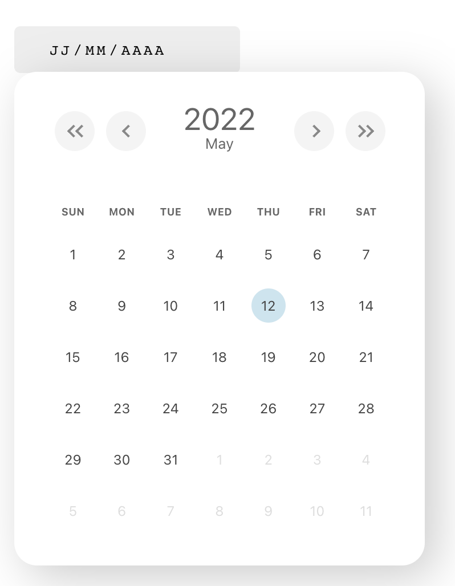

# DATEPICKER

A simple and reusable Datepicker component for React 



## Installation
The package can be installed via **npm**

```bash
npm install datepickerplugin --save
```

Or via **yarn**

```bash
yarn add datepickerplugin
```


```js
// react
import { useState } from 'react';
import {DatePicker}  from 'datepickerplugin';

export default function Component() {
    const [ date, setDate ] = useState('');

    return (
        <div>
            <label>Date Picker</label>
            <DatePicker onChange={(value) => setDate(value)}/>
        </div>
    )
}
```

### Props

| Prop name | Description | Default value | Example values |
| :-------: |:-----------:| :------------:|:-------------:|
| onChange  |   Function called when the user picks a valid date. | n/a | ```onChange={(value) => setDate(value)}``` |
| disabled | Whether the date picker should be disabled | false | true |
| required | Whether date input should be required | false | true |

## Local Development
The master branch contains the latest version of the Datepicker component.

To begin local development:

```bash
npm install
npm build-dev
npm start
```

The last step starts documentation app as a simple webserver on http://localhost:3000.

### Keywords
- ReactJS
- Date Picker
- Calendar
- Date
- React Component
